# Hedgehog Fit – Übungen & Bild-Referenz

20 Büro-Übungen mit Körpergewicht, je ≤ 1 Minute, nur Stuhl, Schreibtisch oder Wand.
Gleichmäßig verteilt über **Mobilisation**, **Kraft** und **Dehnung**. Generiert aus `src/settings.yml`.

Sprüche pro Übung: siehe [uebungen-texte.md](uebungen-texte.md).

---

## 🤸 Mobilisation

### 1. Schulterkreisen
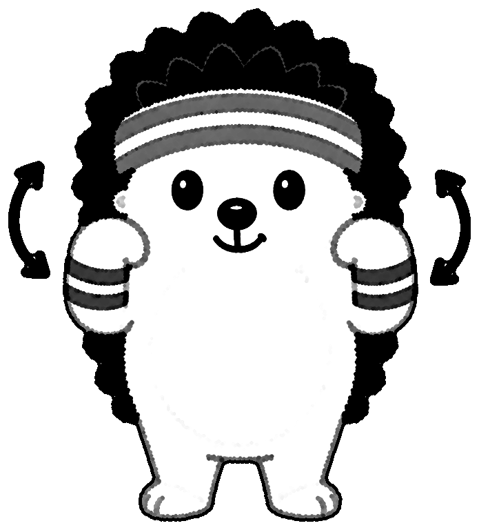

**10× nach hinten** · Hände zu den Schultern, mit den Ellbogen große Kreise nach hinten.

### 2. Kopfdrehung
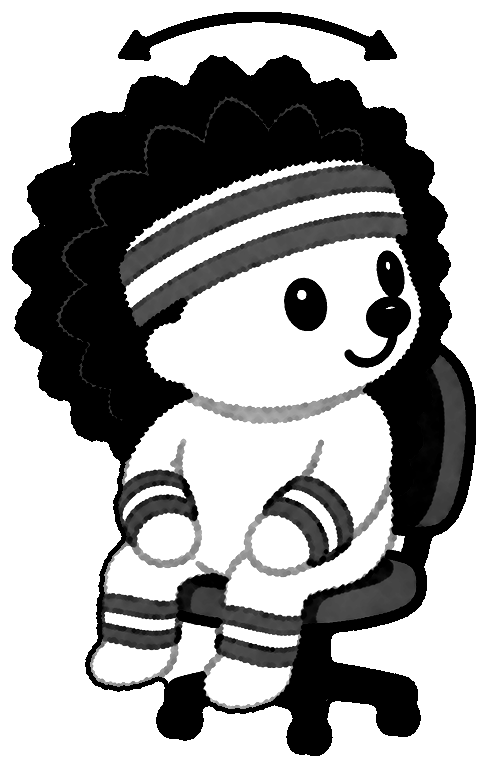

**5× je Seite** · Kopf langsam nach links und rechts drehen, Schultern bleiben locker.

### 3. Katze-Kuh
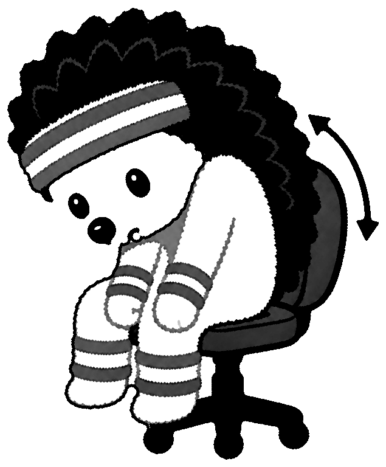

**8× im Wechsel** · Im Sitzen: Rücken rund machen (Katze), dann Brust raus (Kuh).

### 4. Sitz-Drehung
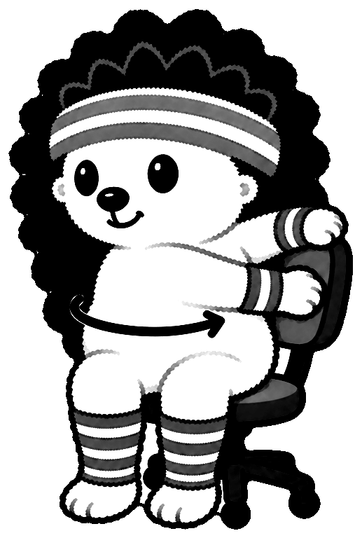

**3 Atemzüge je Seite** · Füße fest am Boden, Oberkörper zur Lehne drehen, Seite wechseln.

### 5. Handkreisen
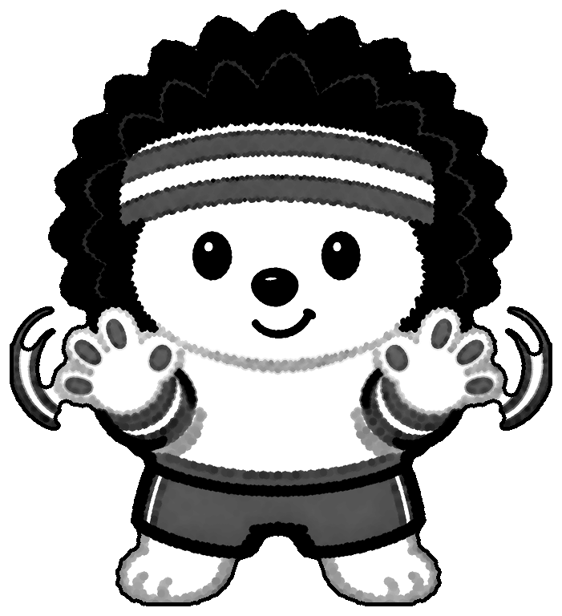

**10× je Richtung** · Finger weit spreizen, ausschütteln, dann die Handgelenke kreisen.

### 6. Armkreisen
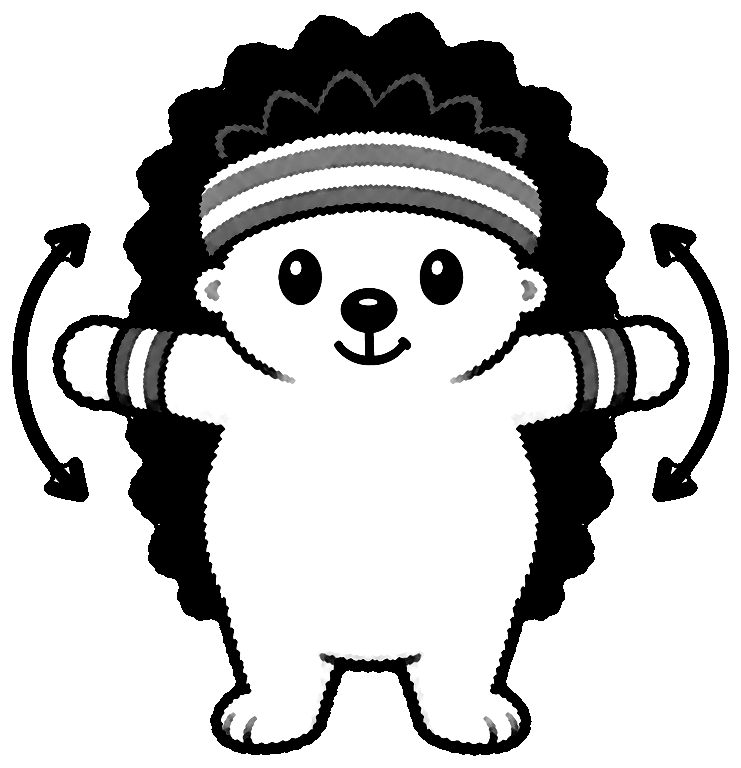

**10× vor, 10× zurück** · Arme seitlich gestreckt, große Kreise vorwärts, dann rückwärts.

### 7. Marschieren
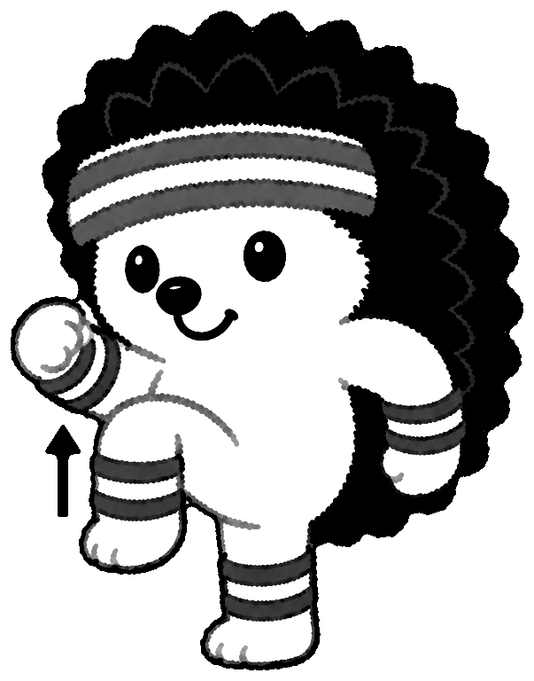

**30 Sek.** · Auf der Stelle marschieren, Knie hoch, Arme schwingen mit.

---

## 💪 Kraft

### 8. Po-Anspannen
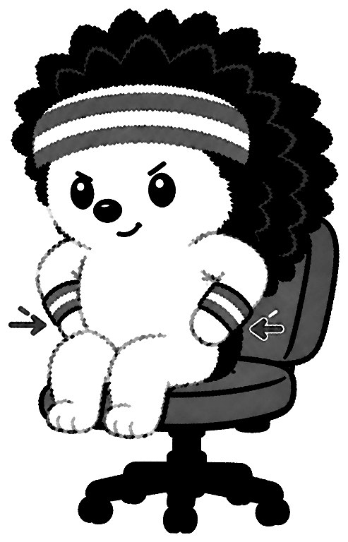

**5× je 5 Sek.** · Im Sitzen den Po fest anspannen, kurz halten, wieder lösen.

### 9. Bizeps-Curls

**10×** · Ellbogen am Körper lassen, Fäuste zu den Schultern heben und senken.

### 10. Kniebeugen
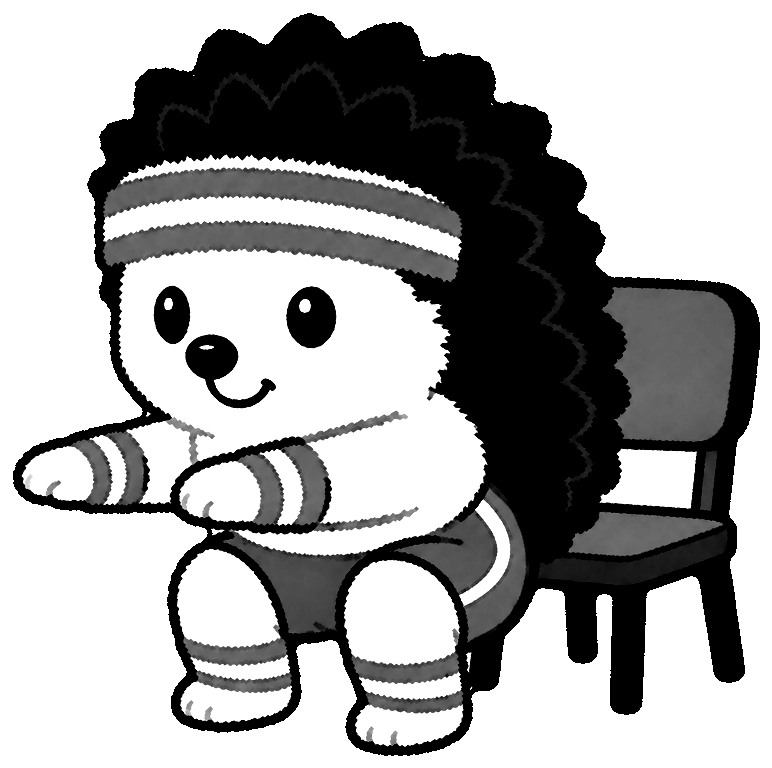

**10×** · Po nach hinten, bis kurz über den Stuhl, Fersen bleiben am Boden.

### 11. Ausfallschritte
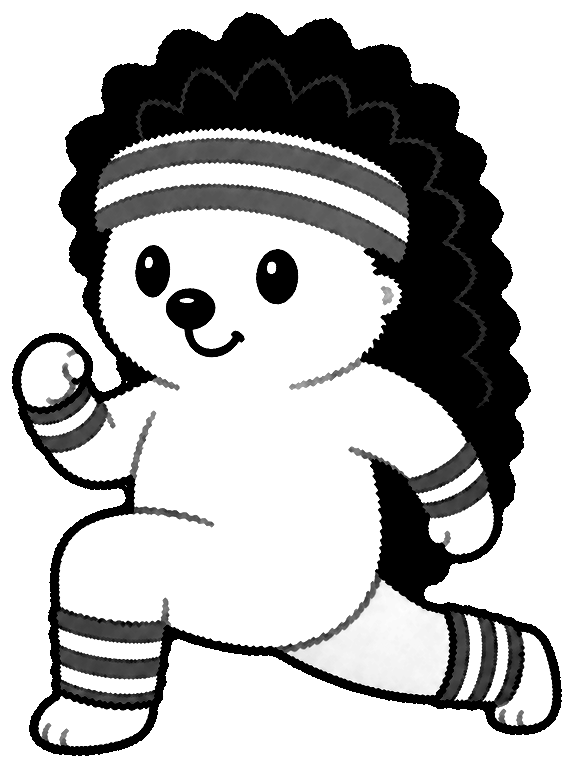

**5× je Bein** · Großer Schritt nach vorn, Knie über dem Knöchel, Bein wechseln.

### 12. Tisch-Liegestütze
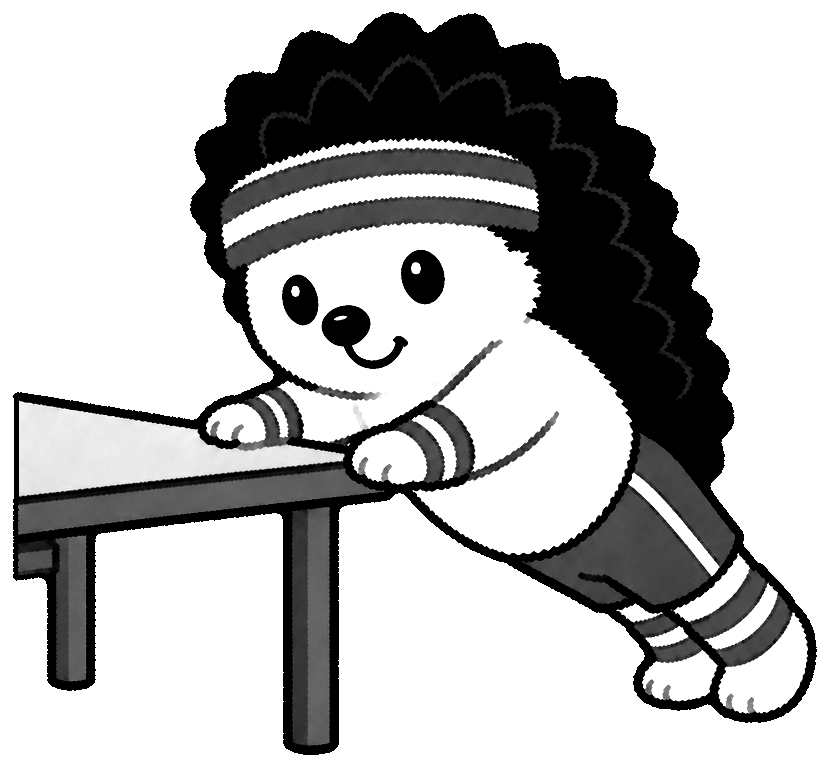

**10×** · Hände an einen festen Tisch, Körper gerade, Brust zur Kante senken.

### 13. Wandsitz
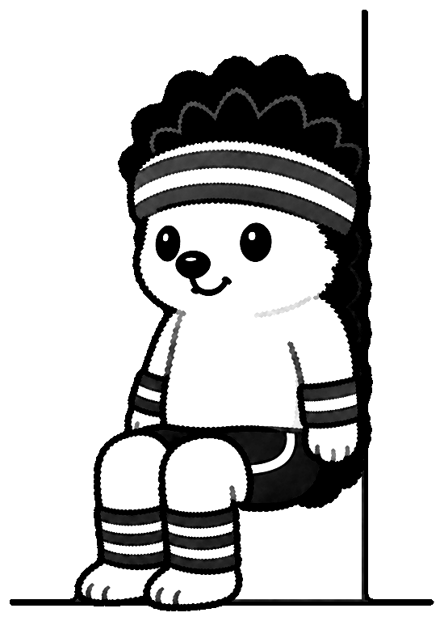

**30 Sek.** · Rücken an die Wand, Oberschenkel waagerecht, Knie über den Knöcheln.

---

## 🧘 Dehnung

### 14. Nackendehnung

**20 Sek. je Seite** · Ohr Richtung Schulter neigen, Hand nur auflegen, nicht ziehen.

### 15. Brustöffner
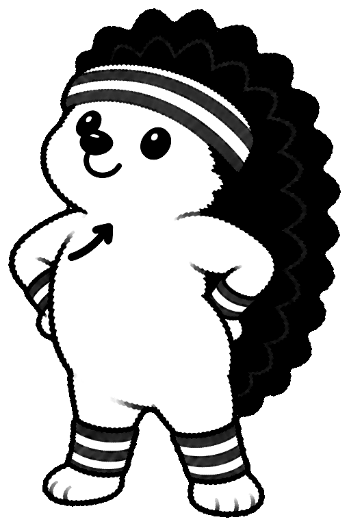

**3 tiefe Atemzüge** · Hände in die Hüften, Ellbogen zurück, Brust raus, Kinn leicht hoch.

### 16. Vorbeuge
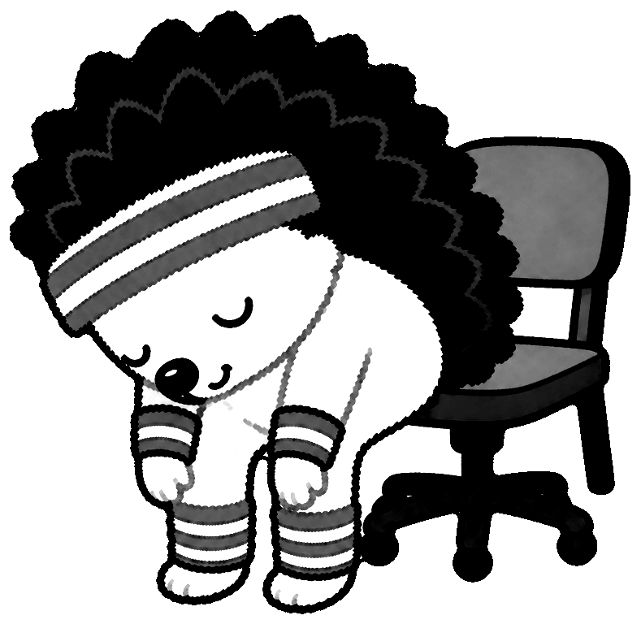

**5 Atemzüge** · Auf der Stuhlkante den Oberkörper hängen lassen, langsam aufrollen.

### 17. Figur-4-Dehnung

**20 Sek. je Seite** · Im Sitzen einen Knöchel aufs andere Knie, Rücken gerade, vorlehnen.

### 18. Handgelenksdehnung
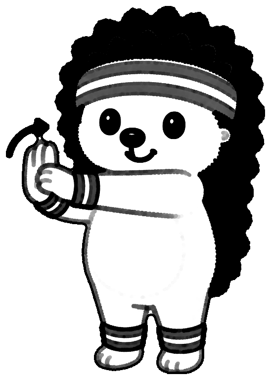

**15 Sek. je Hand** · Arm vorstrecken, Finger mit der anderen Hand sanft zurückbiegen.

### 19. Seitneige
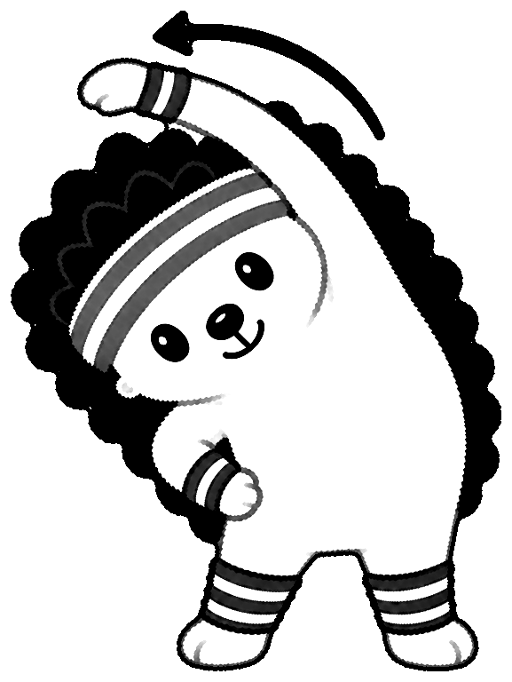

**3 Atemzüge je Seite** · Einen Arm über den Kopf, Oberkörper zur Gegenseite neigen.

### 20. Ganzkörper-Streckung
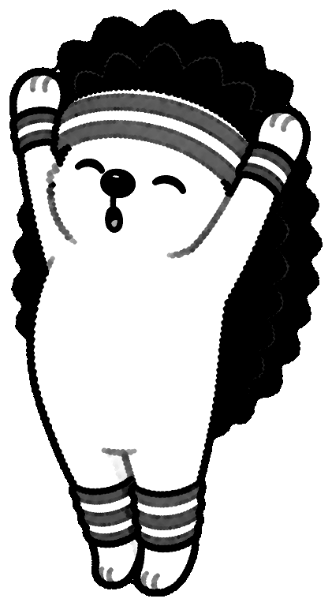

**3× je 5 Sek.** · Auf die Zehenspitzen, beide Arme weit nach oben strecken.
